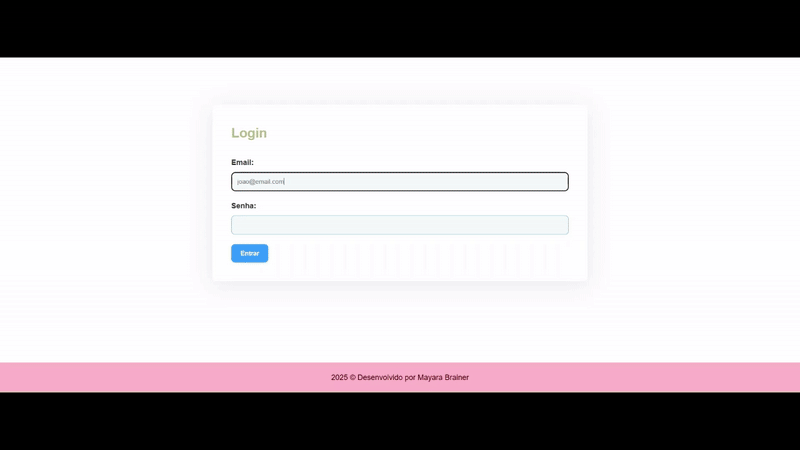

### 🏥 KidsMed - Sistema de Gestão de Consultas Médicas

## 📌 Sobre o Projeto

Este projeto é uma aplicação desenvolvida em Java utilizando o Spring Boot e o Spring Framework, com persistência de dados no MySQL. O sistema permite o cadastro de pacientes, 
o agendamento de consultas com especialistas médicos e a autenticação de usuários com um sistema de login seguro.

## 🚀 Tecnologias Utilizadas

🖥️ Java - Linguagem principal do projeto

🌱 Spring Boot - Framework para simplificar a criação de aplicações Spring

🏗️ Spring Framework - Conjunto de módulos para desenvolvimento robusto

🗄️ MySQL - Banco de dados relacional para armazenar informações

🔒 Spring Security - Implementação de autenticação e autorização

🎯 Funcionalidades

✅ Cadastro de Pacientes 📄

✅ Cadastro de Especialistas Médicos 👨‍⚕️👩‍⚕️

✅ Agendamento de Consultas 🗓️

✅ Listagem e gerenciamento de consultas 🔍

✅ Atualização e exclusão de cadastros ✏️❌

✅ Sistema de Login e Autenticação 🔐

💡 Desenvolvido por Mayara Brainer 🚀
